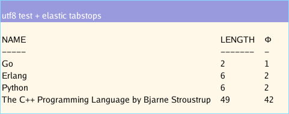

## Frame 
[](https://goreportcard.com/report/github.com/as/frame)

Package frame provides plan9-like editable text images. The package is similar to plan9's libframe, except:



## Features

- `NUL` bytes are preserved
- Semantic replacement characters
- Plain ASCII support
- UTF8 support 
- Elastic tabstop support


## Examples

- Basic
https://github.com/as/frame/blob/master/example/basic/basic.go

- UTF-8
https://github.com/as/frame/blob/master/example/utf8/utf8.go

- Elastic
https://github.com/as/frame/blob/master/example/elastic/elastic.go

- Fast (use if you need better performance or have graphical lag)
https://github.com/as/frame/blob/master/example/fast/fast.go

## Init

A `frame` is created using the New function

```
  img := image.NewRGBA(image.Rect(0,0,100,100))
  fr := frame.New(img, img.Bounds(), frame.NewGoMono(), frame.Mono)
```

## Common Operations

A `frame` supports these common operations

```
  Insert: Insert text
  Delete: Delete text
  IndexOf: Index for point
  PointOf: Point for index
  Select: Select range
  Dot: Return selected range
```

## Insert and Delete

Frames supports two operations for rendering text: `Insert` and `Delete`. 
- `Insert` inserts text at the given index and moves existing characters after the index to the right. 
- `Delete` deletes text in the given range (pair of indices) and moves existing character after the index to the left.

The two operations are inverses of each other.

```
  fr.Insert([]byte("hello world."), 0)
  fr.Delete(0, 11)
```

`Insert` and `delete` return the number of characters inserted or deleted.

To `delete` the last insertion:
```
  p0 := 0
  n := fr.Insert([]byte("123"), p0)
  fr.Delete(p0, p0+n)
```
To execute a traditional "write" operation:

```
  s := []byte("hello")
  fr.Delete(0, int64(len(s)))
  fr.Insert(s, 0)
```

## Projection

Frames can translate between coordinates of the mouse and character offsets in the `frame` using `IndexOf` and `PointOf`.

```
  p0  := fr.IndexOf(image.Pt(0, 0)) Returns the index under the 2D point (0,0)
  pt0 := fr.PointOf(5) Returns the 2D point over the index
```

## Selection

Frames support selecting ranges of text along with returning those selected ranges.

```
  fr.Select(p0, p1)
  fr.Dot()
```

A more complicated facility exists for making a live selection. `Sweep`. See example/basic for an example of
how to use it.

```
 fr.Sweep(...)
```

## Drawing

No special operations are needed after a call to `Insert`, `Delete`, or `Select`. The frame's bitmap
is updated. However, there are four functions that will redraw the frame on the bitmap if necessary.

```
Recolor(pt image.Point, p0, p1 int64, cols Palette)
  Recolor colors the range p0:p1 by redrawing the foreground, background, and font glyphs

Redraw(pt image.Point, p0, p1 int64, issel bool)
  Redraw redraws the characters between p0:p1. It accesses the cache of drawn glyph widths
  to avoid remeasuring strings

RedrawAt(pt image.Point, text, back image.Image)
  RedrawAt refreshes the entire image to the right of the given pt. Everything below is redrawn.

Refresh()
  Refresh recomputes the state of the frame from scratch. This is an expensive operation compared
  to redraw
```

## Display Sync

After any frame altering operation, one can be sure that the changes can be written to
the frame's bitmap. However, the same can not be said for the exp/shiny window. There currently
exists an optimization (see github.com/as/drawcache) that caches rectangles that need to be
redrawn to the screen. This is because shiny (or the native drivers used by it) are too slow to
refresh the entire window if that window's resolution is high.

This rendering pipeline is bottlenecked, so an optimization is located between the |*|

```
insert | frame | shiny buffer |*| shiny window
```

# Note

A frame's text is not addressable. Once the characters are written to the frame, there is no
mechanism to retrieve their position from within the frame. Use a buffer to store text for reading
and the range addresses of the frame to access bytes from that buffer.

See `github.com/as/ui/win` for an example.
